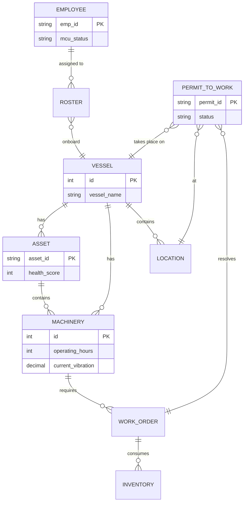
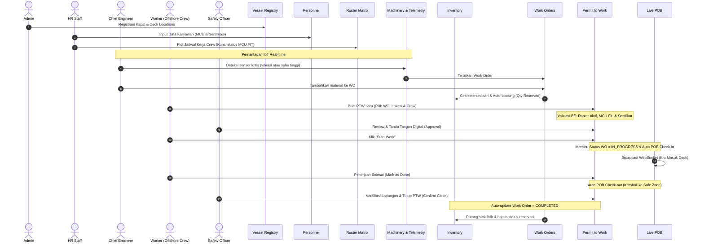

# Saipem HSE: Dokumentasi Alur Sistem (FLOW)

Dokumen ini menjelaskan alur operasional menyeluruh (**End-to-End System Flow**) sistem **Saipem HSE (Health, Safety, and Environment)**, mencakup interaksi antarmuka pengguna (**Frontend - Vue 3**), logika bisnis dan validasi di server (**Backend - Django REST Framework**), serta peran dari setiap **Aktor** di lapangan.

Sistem ini dirancang menggunakan konsep **"Safety Interlocks"** di mana data dari satu modul saling mengunci satu sama lain guna meminimalisasi kecelakaan kerja akibat kelalaian manusia (*human error*).

---

## 1. Bagan Sekuensial Hubungan Data ("The Golden Thread")

### A. System Architecture Diagram
```mermaid
graph TD
    subgraph Frontend [Frontend (Vue 3 + Vite)]
        UI[User Interface]
        Store[Pinia State Management]
        WS_Client[WebSocket Client]
    end

    subgraph Backend [Backend (Django REST Framework)]
        API[REST APIs]
        Auth[JWT Authentication]
        WS_Server[Channels / WebSocket Server]
        Tasks[Background Tasks / IoT Simulator]
    end

    subgraph Database [Data Storage]
        DB[(PostgreSQL / SQLite)]
        Cache[(Redis / In-Memory Channel Layer)]
    end

    UI <-->|HTTP/REST| API
    UI <-->|WebSocket| WS_Server
    API --> Auth
    API --> DB
    WS_Server --> Cache
    Tasks --> DB
    Tasks --> WS_Server
```

### B. Data Model Relationship Diagram (ERD)


### C. Master Workflow Sequence (Mermaid Diagram)


### Referensi Halaman & Berkas Modul:
*   **User Management**: [UserManagementView.vue](frontend/src/views/admin/UserManagementView.vue)
*   **Vessel Registry**: [VesselRegistryView.vue](frontend/src/views/admin/VesselRegistryView.vue)
*   **Personnel (Kru)**: [PersonnelView.vue](frontend/src/views/hr/PersonnelView.vue)
*   **Roster Matrix**: [RosterView.vue](frontend/src/views/hr/RosterView.vue)
*   **Machinery & Telemetry**: [MachineryView.vue](frontend/src/views/MachineryView.vue)
*   **Work Orders**: [WorkOrdersView.vue](frontend/src/views/WorkOrdersView.vue)
*   **Permit to Work (PTW)**: [PtwView.vue](frontend/src/views/PtwView.vue)
*   **Live POB**: [LivePobView.vue](frontend/src/views/LivePobView.vue)
*   **Auth Store (Roster & Medis)**: [auth.js](frontend/src/store/auth.js)

---

## 2. Aktor & Matriks Peran (Role-Based Access Control)

| Aktor / Role | Cakupan Akses & UI | Tanggung Jawab Utama |
| :--- | :--- | :--- |
| **Admin / System Administrator** | Registry Kapal, Pengaturan Deck, Manajemen User | Mendaftarkan kapal baru, menentukan area deck beserta tingkat risikonya, mengelola akun user. |
| **HR Staff** | Registrasi Personel (Crew), MCU, Sertifikasi, Roster Matrix | Mengelola data karyawan, memperbarui status MCU (FIT/UNFIT), menginput sertifikasi keahlian, menugaskan kru ke jadwal roster kapal. |
| **Chief Engineer** | Monitoring Mesin & Inventory, Modul Work Order | Melaporkan kerusakan alat mekanis/listrik di kapal, mengelola stok inventaris terpadu, menerbitkan Work Order (WO) perbaikan peralatan. |
| **Safety Officer** | Approval PTW, Monitor POB, Emergency Control (Condition Red) | Melakukan audit aspek K3, menandatangani persetujuan izin kerja (PTW), memantau manifes orang di kapal secara real-time, mengaktifkan status darurat. |
| **Worker (Offshore Crew)** | Pembuatan PTW, Melakukan Toolbox Talk (TBT), Check-in/out POB | Mengajukan izin kerja PTW untuk perbaikan alat, melakukan briefing keselamatan sebelum bekerja, check-in/out saat masuk area deck. |

---

## 3. Detail Flow Operasional (Langkah Demi Langkah)

### Langkah 1: Manajemen Akun & Hak Akses (User Management)
*   **Aktor**: Admin / System Administrator.
*   **Alur Frontend (FE)**:
    1.  Admin membuka halaman **User Management** ([UserManagementView.vue](frontend/src/views/admin/UserManagementView.vue)) untuk mengelola pengguna.
    2.  Admin mengklik **Add User** untuk mendaftarkan akun baru, mengisi form (Username, Password, Name, Email, Role, dan Job Title), lalu mengirimkan data.
    3.  Untuk pengguna lama, Admin dapat melakukan edit (ganti email, nama, peran/role, atau memperbarui kata sandi secara opsional) atau menghapus akun secara permanen.
    4.  FE mengirimkan request ke `/api/v1/auth/users/` (POST/PUT/DELETE) dengan header `Authorization: Bearer <token>`.
*   **Alur Backend (BE)**:
    1.  Django REST Framework memverifikasi token JWT (`IsAuthenticated`) dan memeriksa izin akses (`IsAdmin`).
    2.  Backend memproses CRUD data pengguna pada tabel auth Django (`User` model) dan menyelaraskan grup otorisasi (`Admin`, `HR Staff`, `Chief Engineer`, `Safety Officer`, atau `Worker`) serta memperbarui `job_role` pada `UserProfile` model.
*   **Hasil Akhir**: Akun pengguna terdaftar di sistem dengan hak akses modul yang sesuai perannya.

### Langkah 2: Registrasi Master Data Kapal & Deck
*   **Aktor**: Admin / System Administrator.
*   **Alur Frontend (FE)**:
    1.  Admin membuka menu **Vessel Registry** ([VesselRegistryView.vue](frontend/src/views/admin/VesselRegistryView.vue)) untuk menambahkan kapal (contoh: *Saipem 7000*).
    2.  Admin membuka menu **Deck Location** ([WorkLocationView.vue](frontend/src/views/WorkLocationView.vue)) untuk mendaftarkan deck compartments (contoh: *Engine Room, Heli Deck*) beserta tingkat bahayanya (Low/Medium/High).
    3.  FE mengirimkan request POST ke `/api/v1/offshore/vessels/` dan `/api/v1/offshore/locations/` dengan header `Authorization: Bearer <token>`.
*   **Alur Backend (BE)**:
    1.  Django REST Framework memvalidasi token JWT (`IsAuthenticated`) dan memeriksa peran pengguna (`Admin` group).
    2.  Data kapal disimpan ke tabel `offshore_module_vessel` ([models.py](backend/offshore_module/models.py#L6-L15)) dan deck disimpan ke `offshore_module_worklocation` ([models.py](backend/offshore_module/models.py#L17-L29)).
*   **Hasil Akhir**: Kapal dan area deck terdaftar di database dan siap digunakan oleh departemen lain.

### Langkah 3: Registrasi Karyawan, MCU & Sertifikasi Kompetensi
*   **Aktor**: HR Staff.
*   **Alur Frontend (FE)**:
    1.  HR membuka halaman **Personnel Registry** ([PersonnelView.vue](frontend/src/views/hr/PersonnelView.vue)).
    2.  HR mendaftarkan kru baru beserta status MCU-nya (`FIT` / `UNFIT` / `EXPIRED`).
    3.  HR menambahkan sertifikasi keselamatan kerja (contoh: sertifikat `HOT_WORK` untuk mengelas, `CONFINED_SPACE` untuk area terbatas) lengkap dengan tanggal kedaluwarsa.
    4.  FE mengirimkan request POST ke `/api/v1/hr/employees/add/` dan `/api/v1/hr/certifications/add/<emp_id>/` disertai header `Authorization: Bearer <token>`.
*   **Alur Backend (BE)**:
    1.  Backend menyimpan profil kru ke tabel `hse_ptw_employee` menggunakan model `Employee` ([models.py](backend/hr_module/models.py#L10-L24)).
    2.  Menyimpan tiket kompetensi keselamatan kerja ke tabel `hr_module_certification` ([models.py](backend/hr_module/models.py#L46-L56)).
*   **Hasil Akhir**: JOHN DOE terdaftar sebagai personel aktif dengan status medis `FIT` dan bersertifikat keselamatan `HOT_WORK`.

### Langkah 4: Penjadwalan Roster Rotasi Kapal
*   **Aktor**: HR Staff.
*   **Alur Frontend (FE)**:
    1.  HR membuka menu **Roster Matrix** ([RosterView.vue](frontend/src/views/hr/RosterView.vue)).
    2.  HR memilih kapal *Saipem 7000* dan mengalokasikan John Doe untuk jadwal rotasi kerja (Roster) dari tanggal `01 Juni` hingga `30 Juni 2026`.
    3.  FE mengirimkan request POST ke `/api/v1/hr/rosters/` dengan body `{ employee: "EMP-001", vessel: 1, start_date: "2026-06-01", end_date: "2026-06-30" }` dengan header `Authorization: Bearer <token>`.
*   **Alur Backend (BE)**:
    1.  **Safety Interlock**: Backend memvalidasi apakah status MCU karyawan tersebut adalah `FIT`. Jika statusnya `UNFIT` atau `EXPIRED`, backend melempar error `ValidationError` dan membatalkan transaksi pada model `Roster` ([models.py](backend/hr_module/models.py#L31-L44)).
    2.  Jika valid, data disimpan ke tabel `hr_module_roster`.
*   **Hasil Akhir**: John Doe resmi terdaftar sebagai kru aktif kapal *Saipem 7000* untuk periode Juni 2026.

### Langkah 5: Pemantauan IoT Telemetri & Pembuatan Perintah Kerja (Predictive Maintenance & Work Order)
*   **Aktor**: Chief Engineer.
*   **Alur Frontend (FE)**:
    1.  Chief Engineer membuka halaman **Machinery & Equip** ([MachineryView.vue](frontend/src/views/MachineryView.vue)).
    2.  Halaman menampilkan status kesehatan real-time untuk setiap mesin (seperti *Generator B, Pompa Utama*) yang dikunci otomatis untuk kapalnya hari ini.
    3.  Aplikasi menampilkan data sensor IoT (Vibrasi dalam `mm/s` dan Temperatur dalam `°C`) serta status sisa umur operasional mesin (**RUL - Remaining Useful Life**).
    4.  Jika kondisi mesin memburuk (Vibrasi > 6.5 mm/s, Temperatur > 78°C, atau jam operasional melebihi interval servis), sistem menandai mesin dengan status **Critical** dan menampilkan tombol aksi **Issue Work Order**.
    5.  Chief Engineer menekan tombol **Issue Work Order**, yang akan mengarahkannya ke menu **Work Orders** ([WorkOrdersView.vue](frontend/src/views/WorkOrdersView.vue)) untuk menerbitkan perintah kerja (contoh: ID `WO-9988`) guna menjadwalkan perbaikan generator tersebut.
    6.  FE mengirimkan request POST ke `/api/v1/asset/workorders/` dengan header `Authorization: Bearer <token>`.
*   **Alur Backend (BE)**:
    1.  Penerbitan WO disimpan ke tabel `asset_module_workorder` menggunakan model `WorkOrder` ([models.py](backend/asset_module/models.py#L127-L140)) dengan status default `PENDING`.
*   **Hasil Akhir**: Perintah perbaikan generator terbit akibat deteksi dini kerusakan (predictive maintenance) dan siap dikaitkan dengan permohonan PTW.

### Langkah 6: Pengajuan Izin Kerja Aman (Permit to Work - PTW)
*   **Aktor**: Worker (Offshore Crew) atau Chief Engineer.
*   **Alur Frontend (FE)**:
    1.  John Doe masuk ke aplikasi. Karena John Doe adalah Aktor *Worker*, sistem **secara otomatis mendeteksi dan mengunci kapal** tempat ia ditugaskan hari ini (*Saipem 7000*) berdasarkan data `assigned_vessel` dari HR saat proses login. John Doe tidak perlu (dan tidak bisa) memilih kapal secara manual di Topbar (fitur ganti kapal di [Topbar.vue](frontend/src/components/layout/Topbar.vue) hanya tersedia untuk Aktor *Admin*).
    2.  John Doe membuka **Permit List** ([PtwView.vue](frontend/src/views/PtwView.vue)) dan mengklik **Create Permit**.
    3.  Aplikasi memunculkan modal pengajuan PTW ([PtwModal.vue](frontend/src/components/PtwModal.vue)) dengan penyaringan otomatis (Safety Interlocks di FE):
        *   Dropdown **Work Order** hanya memuat WO untuk kapal *Saipem 7000* (`/api/v1/asset/workorders/?vessel_id=...`).
        *   Dropdown **Location** hanya memuat deck-deck milik kapal *Saipem 7000* (`/api/v1/offshore/locations/?vessel_id=...`).
        *   Dropdown **Crew Members** hanya menampilkan kru yang terjadwal aktif di roster kapal hari ini (`/api/v1/hse/employees/?vessel_id=...`). John Doe memilih dirinya sebagai pemohon dan beberapa kru pendukung yang terdaftar.
    4.  John Doe memilih tipe permohonan `HOT_WORK` dan mengirimkan form. FE memicu POST ke `/api/v1/hse/ptw/` dengan header `Authorization: Bearer <token>`.
*   **Alur Backend (BE)**:
    1.  **Failsafe Guards (Pintu Pengaman Pertama)**: Backend memverifikasi data di tingkat serializer (`PermitToWorkSerializer` di [serializers.py](backend/hse_module/hse_ptw/serializers.py)):
        *   *Verifikasi Lokasi*: Memastikan deck terdaftar di kapal terpilih.
        *   *Verifikasi Roster*: Memastikan pemohon dan kru yang dipilih ada di dalam daftar roster aktif kapal tersebut hari ini.
        *   *Verifikasi Medis*: Memastikan status kesehatan pemohon dan seluruh kru adalah `FIT`. Jika ada satu saja yang `UNFIT`, backend menolak permohonan.
        *   *Verifikasi Kompetensi*: Karena jenis PTW adalah `HOT_WORK`, backend menyaring database sertifikat. John Doe terbukti memiliki sertifikat `HOT_WORK` yang masih aktif.
    2.  Jika seluruh validasi lulus, backend menyimpan PTW ke tabel `hse_ptw_permittowork` dengan status `PENDING`.
    3.  Melalui WebSocket `ptw_updates`, backend menyiarkan notifikasi ke dashboard Safety Officer secara real-time.
*   **Hasil Akhir**: Pengajuan izin kerja terdaftar di sistem dengan status `PENDING`.

### Langkah 7: Tinjauan Keamanan & Persetujuan PTW
*   **Aktor**: Safety Officer.
*   **Alur Frontend (FE)**:
    1.  Safety Officer masuk ke halaman Dashboard ([DashboardView.vue](frontend/src/views/DashboardView.vue)) dan melihat notifikasi pengajuan PTW dari John Doe.
    2.  Safety Officer meninjau analisis risiko pekerjaan dan kru yang ditugaskan.
    3.  Safety Officer menyetujui permohonan dengan memasukkan tanda tangan digital pada dialog.
    4.  FE mengirimkan request POST ke `/api/v1/hse/ptw/<id>/approve/` dengan header `Authorization: Bearer <token>`.
*   **Alur Backend (BE)**:
    1.  Backend mengecek status darurat global. Jika status sistem dalam keadaan `CONDITION RED` (Lockdown), permohonan approval diblokir otomatis.
    2.  Jika status aman (`GREEN`), backend mengupdate status PTW menjadi `APPROVED`, mencatat nama penyetuju, waktu approval, dan tanda tangan digital.
    3.  Menyiarkan status terbaru via WebSocket.
*   **Hasil Akhir**: Izin kerja berstatus `APPROVED` (Disetujui).

### Langkah 8: Pelaksanaan Kerja & POB Check-in Real-time
*   **Aktor**: Offshore Worker (John Doe) & Crew.
*   **Alur Frontend (FE)**:
    1.  John Doe dan kru berkumpul di area perbaikan, melakukan briefing keselamatan (Toolbox Talk / TBT).
    2.  John Doe membuka aplikasi, menandai TBT telah selesai, lalu menekan tombol **Start Work** di aplikasi.
    3.  FE mengirimkan request POST ke `/api/v1/hse/ptw/<id>/start_work/` dengan header `Authorization: Bearer <token>`.
*   **Alur Backend (BE)**:
    1.  Backend mengubah status PTW menjadi `IN_PROGRESS` ([views.py](backend/hse_module/hse_ptw/views.py)).
    2.  Backend secara otomatis memperbarui status Work Order terkait (`WO-9988`) menjadi `IN_PROGRESS`.
    3.  **Failsafe POB Auto-Check-in**:
        *   Backend membuat baris pencatatan baru pada tabel `hse_pob_poblog` menggunakan model `POBLog` ([models.py](backend/hse_module/hse_pob/models.py#L18-L29)) untuk John Doe dengan `action='IN'` dan `deck_location=Engine Room`.
        *   Backend juga secara otomatis membuat baris log `action='IN'` untuk seluruh kru pendukung yang tercantum di PTW tersebut.
    4.  Backend menyiarkan data manifes terbaru ke WebSocket channel `pob_dashboard`.
*   **Hasil Akhir**: Pekerjaan dimulai, status WO ter-update, dan data John Doe beserta kru otomatis muncul di Dashboard Live POB kapal sebagai kru aktif di area Engine Room.

### Langkah 9: Penutupan Izin Kerja & POB Check-out
*   **Aktor**: Worker (Offshore Crew) & Safety Officer.
*   **Alur Frontend (FE)**:
    1.  Pekerjaan selesai. John Doe memasukkan catatan penyelesaian kerja dan menekan tombol **Mark as Done** (mengirim request ke `/api/v1/hse/ptw/<id>/mark_done/`).
    2.  Safety Officer melakukan inspeksi fisik ke Engine Room untuk memastikan area aman dari bahaya sisa pengelasan.
    3.  Safety Officer menekan tombol **Confirm Close** pada dialog dan mengirim request ke `/api/v1/hse/ptw/<id>/confirm_close/`.
*   **Alur Backend (BE)**:
    1.  **Saat `mark_done` dipanggil**:
        *   Status PTW berubah menjadi `WAITING_FOR_CLOSE`.
        *   Sistem otomatis membuat log keluar `action='OUT'` di tabel `hse_pob_poblog` untuk John Doe dan seluruh kru pendukung.
        *   WebSocket mengirimkan sinyal keluar, sehingga Dashboard Live POB menghapus John Doe dan kru dari manifes Engine Room (kembali ke Safe Zone).
    2.  **Saat `confirm_close` dipanggil**:
        *   Status PTW berubah menjadi `CLOSED`.
        *   Backend otomatis mengubah status Work Order terkait (`WO-9988`) menjadi `COMPLETED` dan mencatat tanggal penyelesaian.
*   **Hasil Akhir**: Pekerjaan selesai dengan aman, manifes kapal bersih (kru tercatat keluar dengan selamat), dan Work Order tertutup sukses.

### Langkah 10: Emergency Muster Drill (Kondisi Darurat)
*   **Aktor**: Safety Officer / Admin.
*   **Alur Frontend (FE)**:
    1.  Dalam keadaan darurat, Safety Officer menekan tombol **Test Alarm** di menu navigasi atas.
    2.  Sistem mengirim parameter status (RED/YELLOW) dan kapal (`vessel_id`) ke `/api/v1/hse/test-trigger/`.
*   **Alur Backend (BE)**:
    1.  Backend mendeteksi PTW yang sedang `IN_PROGRESS` pada kapal tersebut dan menguncinya.
    2.  Status sistem HSE global diubah menjadi status darurat.
    3.  Backend melakukan penyiaran sinyal via *WebSocket Channel* ke semua pengguna yang sedang online.
*   **Hasil Akhir**: Semua layar pengguna akan menampilkan peringatan bahaya, pemutaran suara alarm darurat, dan ringkasan manifes pekerja yang terjebak di area berbahaya (Active PTW Location).
