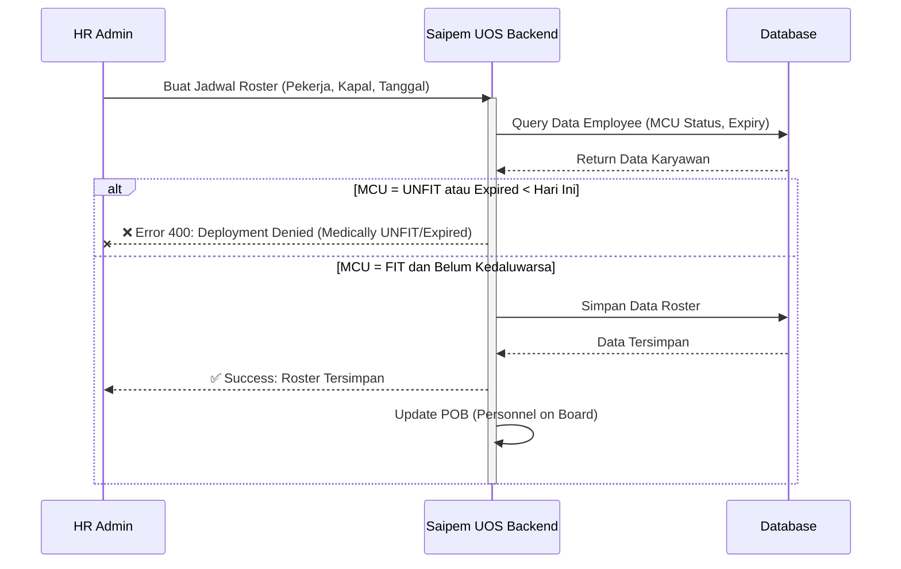
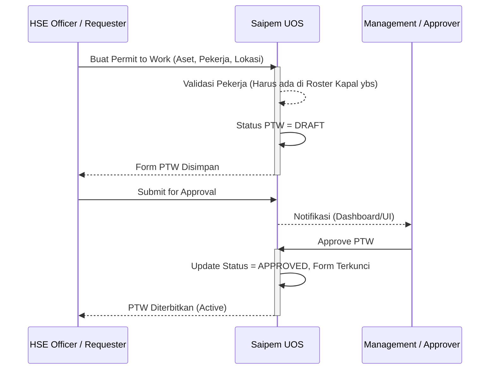
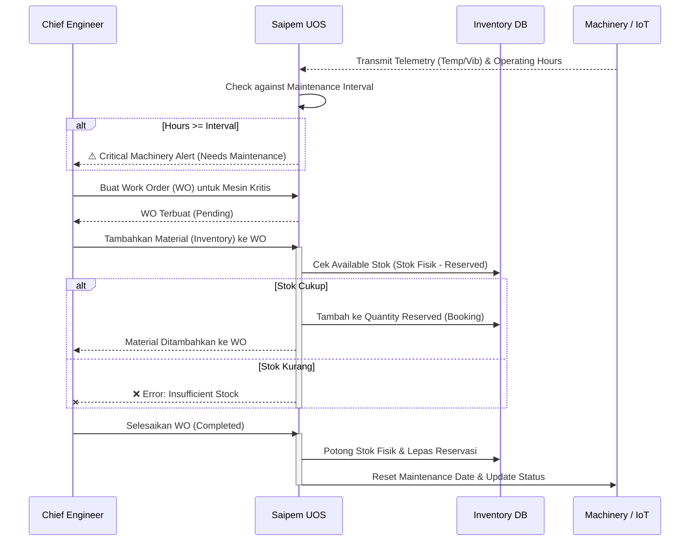
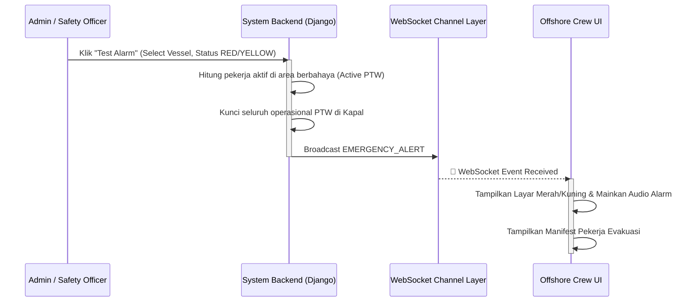

# Saipem UOS (Unified Offshore System)


## 📌 Deskripsi Singkat Proyek

**Saipem UOS** adalah sistem manajemen terintegrasi tingkat lanjut yang dirancang khusus untuk mengelola operasional *Human Resources* (HR), *Asset/Vessel*, dan *Health, Safety, and Environment* (HSE) secara tersentralisasi. Sistem ini digunakan oleh admin, staf HSE, dan manajemen eksekutif untuk memantau status pekerja (termasuk kelayakan medis/MCU), melacak aktivitas kapal, memanajemen asstet, dan menerbitkan Surat Izin Kerja Aman (Permit to Work). Dengan Saipem UOS, koordinasi operasional lepas pantai (offshore) menjadi lebih transparan, aman, dan efisien dari ujung ke ujung.


---

## 🚀 Fitur Utama (Key Features)

- **Sistem Autentikasi Terpusat:** Role-Based Access Control (RBAC) dengan JWT (JSON Web Token) untuk Admin, HR, HSE Officer, Chief Engineer, dan Worker.
- **Multi-Vessel Operations:** Mendukung manajemen operasional, aset, dan pekerja di berbagai kapal (contoh: Saipem 7000, Castorone) secara tersentralisasi.
- **HR Module (Manajemen Personalia & Jadwal):**
  - Manajemen data karyawan lengkap beserta histori sertifikasinya.
  - Penjadwalan Roster pekerja ke kapal (vessel) secara real-time.
  - **Smart Blocker MCU:** Sistem otomatis mencegah pekerja yang berstatus medis *UNFIT* atau sertifikasi kesehatannya telah *EXPIRED* untuk dijadwalkan ke lapangan kerja.
- **Asset Module (Sistem Manajemen Aset & Predictive Maintenance):**
  - **Asset Systems**: Mewakili sistem hierarki induk (misal: Helideck Safety System).
  - **Machinery Equipment**: Komponen fisik di dalam sistem (misal: Main Generator A) dengan pelacakan *Operating Hours* dan penjadwalan *Maintenance*.
  - Terintegrasi dengan **IoT Telemetry Streaming** untuk memantau suhu (Temperature) dan getaran (Vibration) mesin secara *real-time* dengan visualisasi persentase **Fleet Health Score (OEE)**.
  - Work Order (Surat Perintah Kerja) untuk setiap machinery dengan fitur pemotongan stok otomatis (Auto-Deduct Inventory).
- **HSE Module (K3, Permit to Work & Personnel On Board):**
  - Pembuatan dan persetujuan elektronik untuk *Permit to Work* (PTW) dengan fitur *Location Conflict Check* dan *Lockout/Tagout (LOTO)*.
  - Sistem pencatatan **Personnel On Board (POB)** *real-time* berbasis WebSocket (In-Memory Channel Layer).
  - Manajemen Laporan Insiden (Incident Management).
  - **Emergency Muster Drill (Test Alarm)**: Pemicu status darurat (YELLOW/RED) yang langsung mengunci *Permit to Work* aktif dan mengirimkan notifikasi *live* melalui WebSocket ke seluruh pengguna.
- **Dashboard Interaktif & Analitik:** Visualisasi data komprehensif bagi pimpinan untuk memantau KPI keselamatan, *Fleet Operating Hours*, dan stok inventaris.

---

## 📂 Struktur Direktori Proyek (Folder Tree)

Struktur repositori ini dibagi menjadi dua bagian utama: `backend` (Django) dan `frontend` (Vue.js).

```text
saipem-hse/
├── backend/                  # Django REST API Backend
│   ├── asset_module/         # Asset, Machinery, Inventory, & Work Order
│   ├── auth_module/          # Authentication & Manajemen Role Akses
│   ├── core_system/          # URL Utama & Konfigurasi Settings Django
│   ├── hr_module/            # Modul Karyawan, Roster Matrix, & Validasi MCU
│   ├── hse_module/           # Permit to Work, Incident Report, & POB
│   ├── offshore_module/      # Pemetaan Lokasi (Vessel & Area Deck)
│   ├── manage.py             # Entry point utama untuk Django CLI
│   └── requirements.txt      # Daftar dependensi Python
│
├── frontend/                 # Vue.js 3 Frontend Web App
│   ├── public/               # File Statis publik
│   ├── src/                  # *Source code* utama aplikasi Vue
│   │   ├── assets/           # File gambar, CSS/Tailwind
│   │   ├── components/       # Komponen UI Vue yang dapat digunakan ulang
│   │   ├── router/           # Konfigurasi Vue Router (Navigasi URL)
│   │   ├── stores/           # Manajemen State (Pinia)
│   │   ├── views/            # Halaman utama aplikasi (Dashboard, HR, HSE)
│   │   └── App.vue           # Root Component Vue
│   ├── package.json          # Daftar dependensi NPM / Node.js
│   └── vite.config.js        # Konfigurasi *build tool* Vite
│
└── README.md                 # Dokumentasi Proyek yang sedang Anda baca
```

---

## ⚖️ Perbandingan Proses Bisnis (Sebelum vs Sesudah Automasi)

| Proses Manual (Lama) 🔴 | Automasi Sistem (Baru) 🟢 | Dampak Positif 🚀 |
| --- | --- | --- |
| Pengecekan MCU/Sertifikat pekerja dilakukan manual via dokumen kertas/Excel sebelum ditugaskan ke kapal lepas pantai. | **Smart Blocker:** Sistem secara otomatis menolak pembuatan Roster jika status MCU pekerja *UNFIT* atau sudah lewat tanggal kedaluwarsa. | Menghilangkan risiko kelalaian (human error) 100%, memangkas waktu verifikasi medis dari jam menjadi instan. |
| Pengajuan *Permit to Work* (PTW) memakan waktu lama karena pencarian tanda tangan fisik *Safety Officer*. | Persetujuan PTW dilakukan secara digital. Form langsung terhubung ke status aset dan pekerja. | Memangkas waktu tunggu dokumen hingga 80%, pekerjaan lebih cepat dimulai. |
| Manajemen Maintenance dan Work Order aset dicatat dalam dokumen terpisah dengan risiko hilang. | *Work Order* dan *Maintenance Task* terhubung ke *Inventory*. Penggunaan material dicadangkan otomatis (reserved). | Perencanaan pemeliharaan lebih presisi dan riwayat servis terpusat (*traceable*). |
| Sulit melacak total *Personnel On Board* (POB) di atas kapal. | Sistem POB terhubung dengan jadwal *Roster* HR. | Total manifest penumpang (POB) terpantau transparan dan *real-time*. |

---

## 🔄 Diagram Alur Proses Bisnis Terintegrasi (Workflows)

### 1. Alur HR - Roster Scheduling & Smart MCU Blocker


### 2. Alur HSE - Permit to Work (PTW)


### 3. Alur ASSET - Work Order & Maintenance


### 4. Alur HSE - Emergency Muster Drill (Test Alarm)


---

## 🌐 Dokumentasi API Endpoints Lengkap (Django REST)

Seluruh API berada pada path dasar: `http://localhost:8989/api/v1/`

### 🛡️ 1. Auth Module (`/api/v1/auth/`)
Sistem autentikasi menggunakan JWT (JSON Web Token).
- `POST /login/` - Login dan dapatkan akses token
- `POST /token/` - Dapatkan Access & Refresh token (Token Pair)
- `POST /token/refresh/` - Refresh Access token
- `GET /me/` - Mendapatkan profile user yang sedang login
- `POST /logout/` - Logout sistem
- `GET/POST /users/` - Manajemen Akun (List/Create) - *Admin Only*
- `GET/PUT/DELETE /users/<id>/` - Detail, Update, Hapus Akun
- `GET /dev/quick-login-accounts/` - Mendapatkan list akun demo (Dev only)

### 👥 2. HR Module (`/api/v1/hr/`)
- `GET /employees/` - List seluruh karyawan
- `POST /employees/add/` - Menambah karyawan baru
- `DELETE /employees/delete/<emp_id>/` - Menghapus karyawan
- `POST /employees/toggle/<emp_id>/` - Mengganti status ketersediaan (*Available/On Board*)
- `PUT /employees/update/<emp_id>/` - Update profil dan status MCU karyawan
- `GET /rosters/` - List jadwal *Roster*
- `DELETE /rosters/delete/<id>/` - Menghapus *Roster*
- `GET /activities/` - List Vessel Activity (Aktivitas Kapal)
- `DELETE /activities/delete/<id>/` - Menghapus Aktivitas
- `GET /payroll/` - Mengambil kalkulasi otomatis payroll/gaji pekerja
- `GET /analytics/` - Dashboard analitik HR (statistik MCU, roster, dll)
- `GET /positions/` - Master data *Job Position*
- `DELETE /positions/delete/<id>/` - Menghapus posisi
- `GET /certifications/<emp_id>/` - Detail sertifikasi per pekerja
- `POST /certifications/add/<emp_id>/` - Tambah sertifikat baru
- `DELETE /certifications/delete/<cert_id>/` - Hapus sertifikat

### 🦺 3. HSE Module (`/api/v1/hse/`)
- `GET/POST /ptw/` - Buat/List *Permit to Work* (PTW)
- `GET/PUT/DELETE /ptw/<id>/` - Kelola detail PTW (Approve/Reject)
- `GET/POST /employees/` - (Router PTW) List/Tambah pekerja dalam konteks HSE
- `GET /pob/` - Data Personnel On Board (POB) *real-time*
- `GET/POST /incidents/` - List/Buat Laporan Insiden Kecelakaan Kerja
- `GET/PUT/DELETE /incidents/<id>/` - Update Laporan Insiden
- `GET/POST /status/` - System Status Operasional HSE
- `GET /analytics/` - Grafik analitik HSE (Safe man hours, Incident Rate)

### 🚢 4. Offshore Module (`/api/v1/offshore/`)
Manajemen Lokasi (Deck/Area) dan penghubungan ke Kapal Utama.
- `GET /vessels/` - List Kapal (Khusus tampilan relasional area)
- `GET /vessels/<id>/` - Detail Kapal
- `POST /vessels/<id>/assign-decks/` - Menugaskan *Deck/Area* ke dalam suatu Kapal
- `DELETE /vessels/<id>/assign-decks/<deck_id>/` - Melepas penugasan *Deck* dari Kapal
- `GET /locations/` - List Lokasi Offshore (Deck)
- `GET /locations/<id>/` - Detail Lokasi

### 🔧 5. Asset Module (`/api/v1/asset/`)
- `GET /assets/` - List Seluruh Kapal Utama (*Vessel Assets*)
- `GET /assets/<asset_id>/` - Detail *Asset*
- `GET /machinery/` - Peralatan mesin yang terpasang pada *Asset*
- `GET /machinery/<id>/` - Detail *Machinery*
- `GET /workorders/` - List Surat Perintah Kerja (WO)
- `GET /workorders/<id>/` - Detail WO
- `GET /maintenance/` - List Jadwal Tugas Pemeliharaan Rutin
- `GET /maintenance/<id>/` - Detail *Maintenance Task*
- `GET /inventory/` - Stok *Inventory* Barang (Material/Suku Cadang)
- `GET /inventory/<id>/` - Detail Stok

*(Catatan: Sebagian besar endpoint Asset Module mendukung operasi lengkap POST/PUT/DELETE tergantung hak akses role Anda)*

---

## 👥 Pemetaan Tugas Aktor (Actor Role Mapping)

| Aktor / Role | Hak Akses & Aksi Spesifik di Aplikasi | Automasi & Proses Sistem di Latar Belakang |
| --- | --- | --- |
| **Admin / System Administrator** | • *Full Access* ke semua modul sistem.<br>• Manajemen CRUD Akun Pengguna & Role (Assign Role, reset password).<br>• Manajemen Master Data Absolut: *Vessel, Machinery, Job Positions, Location/Deck, Inventory*. | • Log audit sistem terekam untuk setiap perubahan data kritikal.<br>• Menerapkan perlindungan integritas relasi *database* (misal: memblokir penghapusan *Vessel* jika masih ada pekerja *On Board* atau PTW aktif di dalamnya). |
| **HR Staff** | • Menambahkan profil *Employee*, *Job Position*, dan histori *Certification* pekerja.<br>• Menyusun jadwal alokasi pekerja (*Roster Matrix*) ke lokasi/kapal tertentu.<br>• Melakukan pembaruan status kelayakan *Medical Check-Up* (MCU).<br>• Memproses kalkulasi *Payroll/Timesheet* otomatis.<br>• Memantau *Analytics Dashboard* departemen HR. | • **Smart MCU Blocker:** Sistem secara *real-time* menolak form penjadwalan *Roster* jika pekerja berstatus medis *UNFIT* atau sertifikasinya *EXPIRED*.<br>• Kalkulasi penggajian otomatis di- *generate* berdasarkan *Daily Rate* posisi dikali dengan durasi hari pada *Roster*.<br>• *Auto-trigger* penambahan kuota manifest *Personnel On Board* (POB) kapal saat jadwal pekerja dimulai. |
| **Safety Officer** | • Membuat form *Permit to Work* (PTW) untuk pekerjaan berisiko (Panas, Dingin, Ruang Terbatas).<br>• Melakukan *Approval* atau penolakan atas PTW.<br>• Menginput *Incident Report* (Laporan Kecelakaan Kerja).<br>• Memantau daftar riil *Personnel On Board* (POB) harian.<br>• Mengupdate *System Status* keamanan operasional. | • **PTW Location Conflict Check:** Sistem memastikan lokasi/deck *Permit to Work* tidak tumpang tindih dengan pekerjaan berbahaya lainnya di area yang sama.<br>• Saat izin PTW di-*approve*, form tersebut otomatis terkunci oleh sistem (*hukum read-only / immutable*) untuk tujuan audit.<br>• Sistem otomatis mengakumulasi log *Safe Man Hours* harian dari total POB. |
| **Chief Engineer** | • Menerbitkan dan menjalankan *Work Order* (WO) untuk peralatan mesin.<br>• Mengelola stok Inventaris Terpadu secara sentral.<br>• Menjadwalkan *Maintenance Tasks* berkala untuk tiap *Machinery* di atas kapal. | • **Smart Inventory Reservation:** Sistem akan mereservasi (*booking*) stok secara otomatis saat material ditambahkan ke WO, dan baru benar-benar memotong stok fisik ketika WO dinyatakan *Completed*.<br>• Sistem otomatis mengubah status operasional mesin menjadi *Under Maintenance* selama WO berjalan, mencegah mesin digunakan dalam operasional (terhubung ke modul HSE). |
| **Worker (Offshore Crew)** | • *Read-only access* ke portal pekerja (Tampilan khusus Worker Dashboard).<br>• Melihat detail jadwal *Roster* keberangkatan dan penugasan lokasi pribadi miliknya.<br>• Mengecek masa berlaku *Certification* dan *MCU* pribadinya sendiri.<br>• Mengakses form cetak untuk PTW yang ditugaskan kepadanya. | • Pekerja hanya bisa mengakses modul terkait dirinya, dan akses menu di sidebar (*Sidebar*) otomatis disembunyikan berdasarkan *Role* untuk menjaga keamanan data. |

---

## 📸 Tangkapan Layar / Demo Visual

*(Tambahkan Screenshot Aplikasi Di Sini)*
> `Contoh format: `
> `Contoh format: `
> `Contoh format: `

---

## ⚙️ Prasyarat Sistem (Prerequisites)

Pastikan sistem operasi Anda (Windows/macOS/Linux) telah terpasang perangkat lunak berikut:
- **Python** (>= 3.10)
- **Node.js** (>= 18.x) & **NPM** (>= 9.x)
- **PostgreSQL** atau **SQLite** (Default untuk *development*)
- **Git**

---

## 🚀 Saipem HSE - Team Setup Guide

Panduan lengkap untuk *setup project* HSE Management System untuk tim *development*.

---

## 📋 Quick Start (Clone Repository)

Repositori ini bersifat **Public**. Anda dapat langsung melakukan clone tanpa perlu autentikasi khusus.

**Repository**: `https://github.com/DiegoSavio1027/saipem.git`

#### Opsi 1: Clone dengan HTTPS (Cara Standar)

```bash
# Clone repository
git clone https://github.com/DiegoSavio1027/saipem.git

cd saipem-hse
```

#### Opsi 2: Clone dengan SSH (Rekomendasi untuk Kontributor)

Jika Anda akan sering berkontribusi dan sudah melakukan setup SSH key di GitHub:

```bash
# Clone dengan SSH
git clone git@github.com:DiegoSavio1027/saipem.git

cd saipem-hse
```

---

## 🔧 Backend Setup

### Prerequisites
- Python 3.10+
- PostgreSQL 12+ (atau SQLite bawaan Django)
- pip (Python package manager)

### Installation Steps

**1. Navigate to backend directory**
```bash
cd backend
```

**2. Create virtual environment**
```bash
python3 -m venv venv
source venv/bin/activate  # On Windows: venv\Scripts\activate
```

**3. Install dependencies**
```bash
pip install -r requirements.txt
```

**4. Setup environment variables**
```bash
# Copy example env file
cp .env.example .env

# Edit .env dengan database credentials kamu
nano .env  # atau gunakan editor favorit
```

**Required environment variables:**
```env
# Database Configuration
DATABASE_ENGINE=django.db.backends.postgresql
DATABASE_NAME=saipem_offshore_db
DATABASE_USER=pgadmin
DATABASE_PASSWORD=your_password
DATABASE_HOST=localhost
DATABASE_PORT=5432

# Django Settings
DEBUG=True
SECRET_KEY=your-secret-key-here
ALLOWED_HOSTS=localhost,127.0.0.1

# CORS Configuration
CORS_ALLOWED_ORIGINS=http://localhost:5173,http://127.0.0.1:5173

# Media Files
MEDIA_ROOT=media/
MEDIA_URL=/media/
```

**5. Run database migrations**
```bash
python manage.py migrate
```

**6. Seed initial data**
Jalankan perintah berikut secara berurutan untuk mengisi *database* dengan data awal (dummy data) yang lengkap:

```bash
# 1. Initialize system status
python manage.py seed_hse_data

# 2. Create test users & groups
python manage.py seed_auth_users

# 3. Create HR employees, roster, & assets data
python manage.py seed_hr_asset_data

# 4. Create inventory items
python manage.py seed_inventory
```

**7. Create superuser (admin)**
```bash
python manage.py createsuperuser
```

**8. Start development server**
Buka terminal dan jalankan backend server:
```bash
python manage.py runserver 0.0.0.0:8989
```

Backend runs at: `http://localhost:8989`

**9. Run IoT Telemetry Simulator (Opsional namun Penting)**
Buka terminal **baru** (biarkan server tetap berjalan), lalu jalankan simulator IoT untuk menghasilkan data sensor suhu & getaran mesin secara *real-time*:
```bash
python manage.py run_iot_simulator
```

> **💡 Catatan Integrasi Production (Koneksi ke Sistem IoT Asli)**  
> Script simulator di atas menginjeksi data langsung ke *database* menggunakan Django ORM untuk kemudahan *development*.  
> Untuk menghubungkan sistem dengan **perangkat IoT / Sensor fisik sesungguhnya** (seperti NodeMCU, PLC, atau *Edge Gateway*), Anda bisa menerapkan salah satu arsitektur berikut ke depannya:
> 1. **Via REST API (HTTP POST)**: Tambahkan endpoint *ingestion* baru (contoh: `POST /api/v1/asset/telemetry/ingest/`) di backend yang siap menerima payload JSON dari perangkat sensor Anda, lalu menyimpannya ke model `TelemetryLog`.
> 2. **Via MQTT Broker (Rekomendasi Industri)**: Setup sebuah *broker* MQTT (seperti Mosquitto/EMQX). Biarkan sensor *publish* data ke topik MQTT, lalu jalankan sebuah *worker script* di server (menggunakan *library* `paho-mqtt` atau Celery) yang *subscribe* ke topik tersebut dan mencatat datanya ke dalam sistem Saipem UOS secara asinkron.

### Test Users (After Seeding)

| Role | Username | Password | Keterangan |
|------|----------|----------|------------|
| Admin | `admin` | `admin123` | System Administrator |
| HR Staff | `hr_staff` | `hr123` | HR Dashboard & Data |
| Chief Engineer | `chief_engineer_hq` | `chief123` | Chief Engineer (HQ) |
| Chief Engineer | `chief_engineer_s7000` | `chief123` | Chief Engineer (Saipem 7000) |
| Chief Engineer | `chief_engineer_castorone` | `chief123` | Chief Engineer (Castorone) |
| Safety Officer | `safety_officer_hq` | `safety123` | HSE Officer (HQ) |
| Safety Officer | `safety_officer_s7000` | `safety123` | HSE Officer (Saipem 7000) |
| Safety Officer | `safety_officer_castorone` | `safety123` | HSE Officer (Castorone) |
| Worker | `worker` | `worker123` | Worker (Onboard) |
| Worker | `EMP-007` | `saipem123` | Worker (Available) |

---

## 🎨 Frontend Setup

### Prerequisites
- Node.js 18.0+
- npm or yarn

### Installation Steps

**1. Navigate to frontend directory**
```bash
cd frontend
```

**2. Install dependencies**
```bash
npm install
```

**3. Create environment file**
```bash
cat > .env << EOF
VITE_API_BASE_URL=http://localhost:8989/api/v1
VITE_WS_URL=ws://localhost:8989/ws/pob_updates/
EOF
```

**4. Start development server**
```bash
npm run dev
```

Frontend runs at: `http://localhost:5173`

### Available Scripts

```bash
# Development server with HMR
npm run dev

# Build for production
npm run build

# Preview production build
npm run preview
```

---

## 🔐 Authentication (Khusus untuk Push / Kontributor)

Karena repositori ini **Public**, Anda dapat melakukan *clone* dan *pull* secara bebas. Namun, untuk melakukan *push* (berkontribusi), Anda tetap memerlukan autentikasi jika tidak menggunakan SSH.

### Personal Access Token (PAT) Info

**Token**: Buat token baru di [GitHub Settings > Developer Settings](https://github.com/settings/tokens/new)

**Permissions**: Centang `repo` untuk mengelola repositori (Push access).

**Expiry**: Sesuai preferensi Anda (rekomendasi: 30-90 hari)

### Storing PAT Securely

#### macOS (Keychain)
```bash
# Store in Keychain
git config --global credential.helper osxkeychain

# First push will prompt for credentials, then stores in Keychain
git push
```

#### Linux (Pass)
```bash
# Install pass
sudo apt-get install pass

# Configure git
git config --global credential.helper pass

# Initialize pass
pass init your-gpg-key-id
```

#### Windows (Credential Manager)
```bash
# Configure git
git config --global credential.helper manager-core

# First push will prompt for credentials, then stores in Credential Manager
git push
```

---

## 🚀 Development Workflow (Cara Berkontribusi)

Bagi kontributor eksternal, silakan **Fork** repositori ini terlebih dahulu. Bagi tim internal, Anda bisa langsung clone dan membuat branch.

### 1. Pull Latest Changes
Pastikan branch Anda up-to-date dengan origin.
```bash
git pull origin main
```

### 2. Create Feature Branch
```bash
git checkout -b feature/your-feature-name
```

### 3. Make Changes
- Backend: Edit files in `backend/`
- Frontend: Edit files in `frontend/`

### 4. Test Changes
```bash
# Backend tests
cd backend
python manage.py test

# Frontend tests (if configured)
cd frontend
npm run test
```

### 5. Commit Changes
```bash
git add .
git commit -m "feat: description of your changes"
```

### 6. Push to GitHub
```bash
git push origin feature/your-feature-name
```

### 7. Create Pull Request
- Go to GitHub repository
- Create PR from your branch to `main`
- Add description and request review

### 8. Merge to Main
- After review and approval
- Merge PR to main branch
- Delete feature branch

---

## 🐛 Troubleshooting

### Backend Issues

**Database Connection Error**
```bash
# Check PostgreSQL is running
sudo systemctl status postgresql

# Test connection
psql -U pgadmin -d saipem_offshore_db

# If connection fails, check .env DATABASE_* variables
```

**Migration Errors**
```bash
# Show migration status
python manage.py showmigrations

# Reset migrations (CAUTION: deletes data)
python manage.py migrate hse_module zero
python manage.py migrate
```

**Port Already in Use**
```bash
# Run on different port
python manage.py runserver 0.0.0.0:8990
```

### Frontend Issues

**Dependencies Installation Failed**
```bash
# Clear cache and reinstall
rm -rf node_modules package-lock.json
npm install
```

**API Connection Failed**
```bash
# Check .env file
cat .env

# Verify backend is running on http://localhost:8989
# Verify VITE_API_BASE_URL is correct
```

**Port 5173 Already in Use**
```bash
# Run on different port
npm run dev -- --port 5174
```

### Git Issues

**Authentication Failed**
```bash
# Update remote URL with PAT (Atau hapus token lama agar diminta ulang)
git remote set-url origin https://github.com/DiegoSavio1027/saipem.git

# Try push again
git push origin main
```

**Merge Conflicts**
```bash
# Pull latest changes
git pull origin main

# Resolve conflicts in your editor
# Then commit
git add .
git commit -m "Resolve merge conflicts"
git push origin feature/your-branch
```

---

## 📚 Documentation

- **Backend README**: `backend/README.md` - Detailed API documentation
- **Frontend README**: `frontend/README.md` - UI components and features
- **API Docs**: `http://localhost:8989/api/schema/swagger/` (when backend running)

---

## 🤝 Team Collaboration Tips

1. **Always pull before starting work**
   ```bash
   git pull origin main
   ```

2. **Use descriptive commit messages**
   ```bash
   git commit -m "feat: add PTW approval workflow"
   git commit -m "fix: resolve POB tracking bug"
   git commit -m "docs: update API documentation"
   ```

3. **Keep branches updated**
   ```bash
   git fetch origin
   git rebase origin/main
   ```

4. **Review before pushing**
   ```bash
   git diff origin/main
   ```

5. **Communicate with team**
   - Inform team before major changes
   - Discuss architecture decisions
   - Review each other's code

---

## 📞 Support

For issues or questions:
1. Check troubleshooting section above
2. Review backend/frontend README files
3. Check API documentation at `/api/schema/swagger/`
4. Contact team lead

---

**Last Updated**: June 25, 2026  
**Version**: 1.1.0  
**Status**: Ready for Team Collaboration ✅
